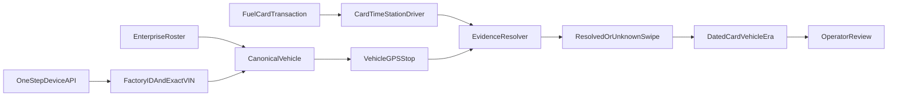

# Fleet Management: Overview and Project Review

## Executive summary

Fleet Management is a system for one PDI vehicle fleet. It combines Enterprise
eFleets records with OneStep GPS data to solve two separate problems:

1. Calculate a trustworthy mileage reading for oil-change planning.
2. Determine which vehicle was associated with a fuel-card transaction when
   vehicle names, card assignments, drivers, and other source fields are
   incomplete or wrong.

The second problem is historical identity resolution, not card tracking. A fuel
card has no GPS. OneStep tracks the device installed in a vehicle. The system
can therefore locate a **vehicle**, then associate a card with it when the card
is used at a known time and station.

The system should never claim that it knows where a card is between
transactions. At most, it can report the card's last confirmed use and its
current inferred vehicle association.

## The two jobs

### 1. Oil-change mileage

The system starts with an Enterprise odometer from a trusted fuel or shop
record, then adds OneStep drive-stop miles measured after that record. This
produces the Last Reading used for oil-change intervals.

This calculation is deliberately isolated from fuel-card matching. Card
evidence must never create or alter mileage.

### 2. Card-to-vehicle identification

Enterprise's Vehicle field is useful evidence, but it is not ground truth. A
card may be moved, shared, assigned to a driver, or recorded against the wrong
vehicle. Fleet Management instead asks:

> Which GPS-identified vehicle was at this fuel station when this card was
> used?

Repeated confirmed uses can establish a dated card-to-vehicle **era**. If a
card later moves, the system starts a new era instead of rewriting its history.

## Identity and evidence flow



The intended process is:

1. Import the Enterprise roster and preserve its canonical `efleets_id`, VIN,
   nickname, and plate.
2. Query the OneStep device API for `factory_id`, `device_id`, and the exact
   OBD VIN reported in `device_state.vin`.
3. Link a OneStep device to a roster vehicle only through a known `factory_id`
   mapping or a unique, exact 17-character VIN match.
4. Preserve every card transaction with its card number, timestamp, station,
   Enterprise vehicle, and driver fields.
5. At the transaction time, look for a short OneStep stop at that station.
6. Resolve the swipe only when the evidence identifies one vehicle. Keep
   conflicting or ambiguous swipes unknown.
7. Use repeated resolved swipes, station history, and driver continuity to
   build effective-dated card-to-vehicle eras.

The implementation for this flow is primarily in:

- [`internal/onestep`](../internal/onestep) for device identity and GPS data
- [`internal/cards`](../internal/cards) for GPS-first matching and card eras
- [`internal/enterprise`](../internal/enterprise) for roster and transaction
  ingestion
- [`internal/store`](../internal/store) for the SQLite working database
- [`internal/oil`](../internal/oil) for the separate Last Reading calculation

## What “known” means

Several different relationships can be known, and they should not be combined
into one number:

| Relationship | Meaning | Strength |
|---|---|---|
| Device → vehicle | OneStep box is linked to one roster vehicle by `factory_id` or unique exact VIN | Stable identity |
| Swipe → vehicle | One GPS-linked vehicle was at the transaction's time and station | Direct event evidence |
| Card → vehicle era | Repeated swipe evidence indicates that a card stayed with a vehicle for a date range | Inferred relationship |
| Card's live location | Where the physical card is right now | Not available |

The operator's estimate of approximately **155 out of 200 card-to-vehicle
associations** is a valuable starting point. It represents recurring usage:
the same card has usually been used with the same car, often by the same or
related drivers. These associations should be loaded as prior evidence to
validate, not treated as 155 GPS-confirmed facts.

The repository's stricter status report dated 2026-09-04 records **63 of 205
vehicles with GPS-supported card eras (30.7%)**. It also records **196 of 205
vehicles with device links (95.6%)** after map and exact-VIN matching. These
figures do not contradict the 155 estimate:

- 155/200 describes practical, recurring card assignments.
- 196/205 describes vehicle-to-GPS-device identity.
- 63/205 describes card eras that passed the current strict GPS evidence rules.

The goal is to validate and explain more of the approximate assignments without
turning assumptions into facts.

## Handling bad data and aliases

Bad source data is expected. The resolver should preserve raw values and keep
canonical identity separate from aliases.

### Evidence priority

Use evidence in this order:

1. **Strongest:** exact device identity plus a unique vehicle GPS stop at the
   transaction time and station.
2. **Strong:** repeated exclusive GPS-confirmed uses of the same card with the
   same vehicle across multiple stations.
3. **Supporting:** the same driver or a known related-driver group repeatedly
   using the card with that vehicle.
4. **Prior only:** Enterprise Vehicle, card labels, nicknames, plates, and
   OneStep display names.

Lower-ranked evidence can support a result but should not override conflicting
GPS or exact identity evidence.

### Governed aliases

The project would benefit from an explicit alias registry. Each alias should
record:

- entity type: vehicle, card, driver, station, person, or office
- raw alias and normalized alias
- canonical entity ID
- evidence source
- effective start and end dates
- status: suggested, verified, rejected, or expired
- reviewer and review time for manual decisions

Safe normalization includes trimming whitespace and normalizing case or known
formatting. Approximate text matching can suggest candidates for review, but it
should not automatically join records. In particular:

- `display_name` is a label, never a vehicle join key.
- Plates and nicknames can change or be duplicated.
- Similar driver names may indicate continuity, but they do not identify a
  vehicle by themselves.
- Duplicate or conflicting VINs must remain unresolved.

## Current architecture

```text
Enterprise roster, fuel DETAILS, and shop records ─┐
                                                   ├─> SQLite working database
OneStep devices, VINs, stops, and drive-stop miles ┘          │
                                                              ├─> Oil computation
                                                              ├─> Card resolution
                                                              ├─> Oil Desk mirror
                                                              └─> Neon backup
```

- The Go CLI under [`cmd/oilchange`](../cmd/oilchange) runs ingestion,
  computation, card analysis, synchronization, and the embedded desk.
- SQLite is the working store.
- Supabase publishes the Oil Desk's fleet view.
- Neon is a backup of the SQLite tables.
- The embedded web UI under [`web`](../web) presents oil and card information.

For command and setup details, see the [root README](../README.md). For the
non-negotiable calculation and identity rules, see
[`docs/collab/OIL-LOCKS.md`](collab/OIL-LOCKS.md).

## Project review

### What is working well

1. **The resolver fails closed.** Two candidate vehicles produce no assignment
   instead of a guess.
2. **Vehicle identity uses durable keys.** `factory_id` and exact unique VIN
   matching are substantially safer than tracker labels.
3. **Raw and resolved identities remain separate.** The recorded Enterprise
   vehicle is preserved even when GPS calls the swipe differently.
4. **Card movement is modeled over time.** Split cards and dated eras avoid one
   permanent last-write-wins assignment.
5. **Oil mileage is isolated.** Card logic cannot silently corrupt Last
   Reading.
6. **Tests cover known bad-data cases.** Fixtures include wrong-card use,
   duplicate-looking labels, card mixes, personnel-held cards, and ambiguous
   GPS cases.

### Main gaps

1. **The GPS identity layer is ahead of the card evidence layer.** Device
   linkage is above 95%, while strict GPS-supported card-era coverage is
   30.7%.
2. **The transaction window is too short.** A 30-day DETAILS export does not
   provide enough repeated uses for cards that fuel infrequently.
3. **Exclusive-stop evidence becomes scarce in shared lots.** More linked GPS
   boxes correctly reveal more ambiguity; weakening the rule would increase
   coverage by increasing false matches.
4. **The approximate 155 associations are not modeled as reviewable priors.**
   Useful operator knowledge is therefore separate from the evidence pipeline.
5. **GPS-called identity is not fully durable.** `CalledEFleetsID` currently
   exists on the in-memory transaction model, limiting later audits and
   comparisons.
6. **Aliases are handled by individual rules rather than one governed model.**
   There is no central history of why an alias was accepted or rejected.
7. **Live Enterprise ingestion is operationally constrained.** MFA and export
   URL handling make reliable automated history collection difficult.
8. **The current “known” target combines different concepts.** Vehicle/device
   coverage, resolved-swipe coverage, and stable card-era coverage should be
   measured separately.

## Recommended completion path

### Priority 1: finish vehicle identity

Query OneStep devices for their OBD VINs and retain the raw response with a
fetch timestamp. Match only a unique exact 17-character VIN to the Enterprise
roster. Continue using the existing `factory_id` links where present.

Produce explicit work queues for:

- roster vehicles without a device
- devices without a valid VIN
- VINs absent from the roster
- duplicate or conflicting VINs
- inactive or replaced devices

This establishes which physical vehicle each stream of GPS stops belongs to.

### Priority 2: widen transaction history

Ingest at least a rolling 90-day Fuel DETAILS history, with overlap between
imports so late or corrected records are not missed. Deduplicate by stable
transaction identity while preserving source rows.

More history should improve repeated-use evidence without weakening the
exclusive GPS rule.

### Priority 3: import the approximate assignments as priors

Represent the approximately 155 recurring card-to-vehicle relationships as
candidate assignments with their source and effective dates. Do not write them
directly as confirmed card eras.

For each candidate, compare:

- number of unique GPS-confirmed swipes
- number of confirming stations and dates
- contradictory vehicle calls
- driver continuity
- time since the last confirming use

Promote a candidate only under documented thresholds. Route contradictions to
operator review.

### Priority 4: persist resolution evidence

Store the resolution of every swipe, including:

- recorded Enterprise vehicle
- resolved vehicle, if any
- resolution status and reason
- matching device and VIN
- GPS stop and distance from the station
- evidence rule and confidence class
- resolver version and resolution time

This makes every card era explainable and allows the system to be rebuilt when
matching rules improve.

### Priority 5: add aliases with review controls

Add the governed alias registry described above. Use it to normalize known
vehicle, card, driver, and station aliases while retaining all raw source
values. Fuzzy matches should enter a suggestion queue rather than changing a
canonical relationship.

### Priority 6: build the operator review loop

The Cards Desk should prioritize:

- approximate assignments awaiting GPS confirmation
- Enterprise vehicle versus GPS vehicle disagreements
- cards that changed vehicles
- one card appearing with multiple drivers or cars
- unknown swipes with one near-match
- stale associations with no recent confirming use

Each decision should record who made it, why, and the effective date range.

### Priority 7: separate and monitor quality metrics

Track at least:

- vehicle-to-device identity coverage
- percentage of eligible swipes resolved by GPS
- active cards with a current evidence-backed era
- confirmed, inferred, stale, conflicted, and unknown associations
- false-match corrections after operator review
- age of the latest evidence

A 95% device-link target is realistic because device identity is mostly
stable. A 95% card-era target may not be appropriate for inactive, shared,
person-held, or office cards. The project should prefer an honest unknown over
a forced pairing.

## Location scope

There are two distinct location questions:

1. **Where was the car when the card was used?** The existing GPS stop and card
   transaction pipeline can answer this historically.
2. **Where is the car now?** OneStep may be able to provide the vehicle's
   latest position, but this requires a separate last-known-position data path
   and UI. It does not depend on the card.

Neither question reveals the live location of a physical card. With no recent
transaction, the system can only say which vehicle the card was last confirmed
or inferred to be with.

## Non-negotiable rules

- Never use OneStep display names as vehicle identity.
- Never guess a device-to-vehicle link from a nickname or plate.
- Never overwrite raw Enterprise evidence with a resolved value.
- Never assign an ambiguous swipe merely to improve coverage.
- Never let card resolution write Last Reading.
- Never invent mileage or replace a missing measurement with zero.
- Keep HOLD/unknown states visible until the missing evidence is supplied.

The complete operational locks remain authoritative in
[`docs/collab/OIL-LOCKS.md`](collab/OIL-LOCKS.md).
